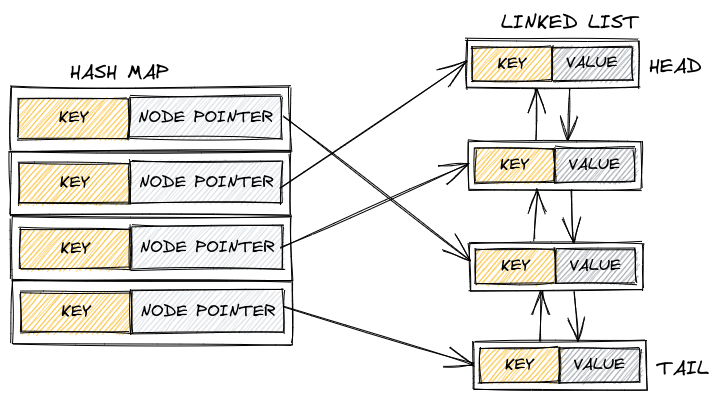

Reference:  
Topics: [Software Engineering](Topics/Software%20Engineering.md)  

---

LRUCache stands for Least Recently Used Cache and it is a data structure
used to cache frequently used data. When full it evicts the least recently
used data. 

Costs:
- Insertion(insert): $O(1)$
- Retrieval(get): $O(1)$
- Deletion(evict): $O(1)$
- Space: $O(n)$

Commonly used in systems where frequently accessed data needs to be
cached in memory for faster access such as web servers, databases, and
operating systems.

An example of an LRUCache interface:
```cpp
template<class Key, class Value>
class lru_cache
{
public:
    lru_cache(size_t capacity);
    ~lru_cache();

    //put
    void insert(const Key &key, const Value &value);
    //get
    std::optional<value_type> get(const Key &key);
j
    size_t size() const;
    size_t capacity() const;
    bool empty() const;
    bool contains(const Key &key);
    void clear();
};

```

A typical architecture for an LRUCache involves a doubly linked list and a
hash map.

