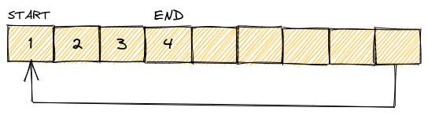

Reference:  
Topics: [Software Engineering](Topics/Software%20Engineering.md)  

---

Ring buffers (also known as circular buffers), is a fixed size buffer that
behaves as if the end was connected to the beginning like a 'ring'.

Commonly used in real-time systems, such as audio and video streaming,
where data needs to be continuously processed and output without delay.
Also used in network protocols to mange transfer between devices.

Cost:
- Insertion: $O(1)$
- Retrieval: $O(1)$
- Space: $O(n)$

Basic interface operations:
- `push()`
- `pop()`
- `front()`
- `back()`
- `size()`
- `capacity()`

